# Chapter 2

## 2.0 Introduction

Literature review is important in a final-year computing project because it shows where a proposed system belongs within the wider body of practice and prior design thinking. For this study, the review is not limited to reservation software in isolation. The project sits at the intersection of hotel operations, role-based information systems, digital payment processing, and smart-room monitoring.

The present hotel management system was developed as a practical answer to familiar operational problems: fragmented room records, slow front-desk coordination, weak visibility into payment state, and poor linkage between ordinary hotel transactions and health, safety, and environment awareness. A useful review therefore has to examine both conventional hotel management software and the newer expectation that software should support operational intelligence rather than record keeping alone.

## 2.1 Evolution of Hotel Management Systems

Hotel operations were once managed through paper ledgers, wall charts, manual cashbooks, and face-to-face front-desk communication. Those methods were workable for small guest houses, but they became unreliable as hotels needed faster room turnover, better audit trails, and clearer visibility into who was arriving, departing, or owing payment. Manual systems also made it difficult to coordinate between reception, management, and support staff in real time.

The first wave of computerized hotel tools focused mainly on digitizing bookings, room allocation, and billing. Later web-based systems expanded that scope by allowing public room browsing, remote reservation, and centralized staff access. In the current stage of development, hospitality software is expected to do more than store data. It is increasingly judged by how well it supports live decisions, role-specific dashboards, secure payment confirmation, and operational monitoring across the property.

## 2.2 Core Functions in Contemporary Hotel Applications

A modern hotel platform usually combines several responsibilities inside one workflow. It must manage room inventory, customer identity, booking windows, check-in and check-out events, payment state, and staff activity. These modules are tightly connected. A booking affects room status. A payment event affects confirmation state. A checkout event affects housekeeping readiness. Good software reflects these dependencies instead of treating each activity as a disconnected form.

Another major expectation in current systems is role separation. Guests need simple room discovery and reservation pages. Administrators need a strategic view of rooms, users, employees, revenue-related figures, and alerts. Reception staff need a narrow but faster operational view that emphasizes today's arrivals, departures, room readiness, guest search, and pending payments. When those views are not separated properly, the system becomes cluttered and slows down the users who depend on it most.

## 2.3 Smart Hotel Monitoring and HSE Awareness

Smart-hotel thinking adds a second layer to ordinary hotel management: visibility into what is happening physically inside the building. Temperature drift, gas leakage, unusual motion, or device silence may all be operationally important even when the reservation records look normal. This matters because a room can be correctly marked as occupied or available while still presenting an environmental or security risk that staff should respond to quickly.

In many academic and prototype environments, real sensors are not always available. Even so, simulated monitoring remains valuable when it is designed responsibly. A simulation can still model the logic of device registration, payload generation, threshold evaluation, alert persistence, acknowledgement, and resolution. In that sense, a simulation-driven IoT layer is still useful for demonstrating how HSE monitoring can be embedded into hotel workflow rather than left as a theoretical add-on.

## 2.4 Observed Gaps in Existing Approaches

A recurring weakness in many hotel software examples is that the guest-facing booking experience is improved while the internal operating experience remains shallow. Systems often allow room reservation, yet provide limited support for receptionist-specific actions such as fast guest lookup, guided check-in and check-out, housekeeping follow-up, or monitoring of unsettled payments. That gap matters in practice because reception is where operational delays become visible first.

A second gap is the weak connection between payment confirmation and booking persistence. In many simplified prototypes, payment is discussed conceptually but not handled as an actual control point in the reservation lifecycle. A third gap is the separation of safety monitoring from normal hotel software. When room-condition alerts live outside the same application that manages bookings and staff actions, accountability becomes weaker and response time may suffer.

*Table 2.1: Comparison of traditional hotel handling, ordinary web tools, and the present integrated project.*

| Dimension | Traditional hotel handling | Ordinary web hotel tool | Present project |
| --- | --- | --- | --- |
| Reservation capture | Desk ledger or phone call | Online form only | Online form plus validated booking workflow |
| Payment linkage | Manual reconciliation | Sometimes external to reservation logic | Paystack verification tied to booking confirmation |
| Staff access | Verbal coordination | Often one generic admin view | Separated admin and receptionist dashboards |
| Room turnover visibility | Paper notes or memory | Partial status visibility | Room state and housekeeping status stored together |
| Safety awareness | Manual observation | Usually absent | Simulated IoT monitoring with persistent alerts |

## 2.5 Relevance to the Present Project

The current project responds directly to those gaps by combining public room discovery, structured online booking, Paystack-backed payment verification, administrative control, receptionist workflow support, and an IoT-style monitoring module inside one Django application. This makes the system stronger as a project document because the chapters can discuss a single integrated platform rather than unrelated feature demonstrations.

The project is also relevant as a smart-hospitality prototype. It shows that even without physical hardware devices, a system can still preserve the end-to-end monitoring pattern: assign a logical device to each room, generate or receive readings, evaluate them against room context, raise alerts, and expose those alerts on operational dashboards. That integration is the main conceptual strength of the work and is what distinguishes it from a basic booking website.

## 2.6 Conclusion

The literature and practice background reviewed in this chapter point to a clear direction: hotel software is most useful when it connects reservations, payments, staff workflow, and operational visibility in one coherent system. This project follows that direction. The next chapter therefore explains how the system was designed and implemented as a structured web application with both transactional and monitoring responsibilities.

# Chapter 3

## 3.0 Introduction

This chapter explains how the hotel management system was analysed, structured, and prepared for implementation. The focus is not only on software coding, but on how the project was broken into coherent modules that reflect real hotel work: user access, room inventory, booking validation, payment progression, receptionist operations, and room-condition monitoring.

Because the system serves different categories of users and combines both transactional logic and simulated environmental monitoring, the design had to be modular. The methodology described here therefore emphasizes layered architecture, explicit data models, and feature flows that can be tested independently while still contributing to one unified application.

## 3.1 Development Approach

An iterative development approach was adopted. The project did not emerge as one large implementation pass; it matured feature by feature. Public pages and authentication came first, followed by room inventory and booking logic, then payment control, staff dashboards, housekeeping linkage, and finally the IoT alerting workflow. This sequence reduced complexity because each stage built on a stable foundation from the previous one.

The iterative approach was especially useful because it allowed the project to remain realistic. For example, the payment flow was upgraded from a simple record-keeping idea into a Paystack-backed confirmation step, and the receptionist workflow evolved into a dedicated dashboard rather than remaining a generic admin extension. The same pattern applied to the HSE component, which matured from a concept into a database-backed monitoring subsystem.

## 3.2 Requirement Analysis

Requirement gathering was guided by the actual roles represented in the system. Guests require visibility into available rooms, stay cost, booking dates, and account access. Administrators require deeper control over rooms, bookings, users, employees, salaries, and monitoring summaries. Reception staff require quick-action tools for arrivals, departures, search, payments, and housekeeping coordination. The monitoring layer, though automated, behaves as another operational stakeholder because it continuously contributes room-condition events to the system.

Functional requirements were therefore grouped around role-specific outcomes rather than abstract menus. The system had to redirect users to the correct dashboard, prevent room clashes, preserve payment state, support room-status updates, create housekeeping tasks after checkout, and evaluate simulated room-condition data against meaningful thresholds. Non-functional requirements were equally important: usability, role isolation, persistence, and maintainability were all necessary for the project to remain credible as a final-year system.

*Table 3.1: Stakeholder groups and the interfaces that serve them in the implemented system.*

| Stakeholder | Primary responsibility in the system | Main interface focus |
| --- | --- | --- |
| Guest | Browse rooms, submit reservations, review booking/payment state | Public pages and booking flow |
| Administrator | Monitor hotel-wide performance and manage operational records | Custom admin dashboard |
| Receptionist | Handle arrivals, departures, search, desk payment, and room readiness | Reception dashboard and boards |
| Monitoring service | Generate and evaluate room-condition readings | IoT dashboard and alert center |

## 3.3 System Architecture

The architecture follows a standard layered Django pattern. The presentation layer is formed by HTML templates, Bootstrap-driven layout elements, and page-specific CSS or JavaScript enhancements. The application layer contains the view logic, validation rules, role checks, session handling, and feature orchestration. The data layer is provided by Django models backed by SQLite for the prototype environment.

The architecture is deliberately split across two application domains. The `HotelApp` module handles users, rooms, bookings, payments, employees, salaries, housekeeping tasks, and activity logs. The `alerts` module manages logical devices, sensor readings, alert lifecycle, notification records, and monitoring snapshots. This split keeps the smart-monitoring responsibilities close to the hotel workflow without allowing them to overwhelm the ordinary reservation code.

## 3.4 Data Design

The data design of the project mirrors the operational relationships inside a hotel. Room records sit at the centre because both online and offline bookings depend on them, payments refer back to them indirectly through booking type and booking identifier, and housekeeping tasks are created around their turnover state. The custom user model adds role information that makes it possible to route administrators, reception staff, and guests differently after authentication.

For the monitoring subsystem, additional entities were introduced instead of overloading the ordinary hotel tables. Logical device records, sensor readings, room-condition alerts, and notification logs are persisted separately so that the monitoring lifecycle can be audited over time. That separation keeps the design clean and allows the HSE module to remain expandable if physical devices are later connected to the platform.

*Table 3.2: Core persistent entities and their responsibilities in the current implementation.*

| Entity | Purpose in the implemented system |
| --- | --- |
| Authorregis | Custom email-based user model with receptionist and staff roles |
| Room | Stores room number, type, floor, facilities, price, availability, and housekeeping state |
| OnlineBooking | Persists guest-submitted reservations after successful payment |
| OfflineBooking | Persists front-desk or walk-in bookings |
| Employee | Stores hotel staff bio-data and department records used in operations |
| Salary | Stores compensation records linked to each employee entry |
| Payment | Tracks payment method, status, receipt, and Paystack references through booking_type and booking_id |
| HousekeepingTask | Coordinates room-turnover work after checkout or support actions |
| ActivityLog | Records important operational actions for audit and visibility |
| IoTDevice | Assigns a logical monitoring device to each room |
| SensorReading | Stores temperature, gas, motion, and overall room condition history |
| RoomConditionAlert | Stores active and resolved HSE incidents tied to readings |
| AlertNotification | Stores simulated email or SMS notices generated from room-condition alerts |

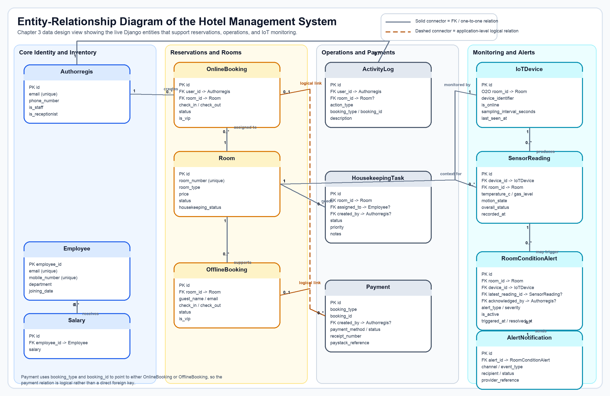

*Figure 3.1: Entity-relationship diagram showing how the booking, operations, payment, and IoT monitoring tables are connected in the current implementation.*

Figure 3.1 complements Table 3.2 by showing the actual structural links behind the system. Solid connectors represent direct foreign-key or one-to-one relationships in the Django models, while the dashed payment connector highlights the current application's logical booking link implemented through `booking_type` and `booking_id` rather than a strict database foreign key.

## 3.5 Workflow Design

The public guest workflow begins with room browsing, continues into the booking form, validates stay dates and guest counts, stores a pending reservation in session, and then moves to the payment page. Only after payment verification does the system create the persistent booking record and mark the room as reserved. That sequence is important because it avoids the common prototype problem where bookings are written before payment outcome is known.

The internal operational workflow is different. Administrators use the dashboard as a control surface for aggregated information and management links, while reception staff use a more focused workflow around arrivals, departures, room status, housekeeping, and desk payments. The IoT workflow runs alongside both human paths. It generates or receives room-condition data, evaluates that data, writes sensor history, and updates alerts that become visible to staff through the monitoring pages.

## 3.6 Development Environment and Tools

The implemented stack is centered on Python and Django. HTML, CSS, JavaScript, and template rendering support the interface. SQLite provides a lightweight but reliable persistence layer for the academic prototype. Paystack is used as the active payment gateway in the guest booking flow, while optional notification backends allow the monitoring module to record or dispatch alert messages.

For the documentation refresh itself, a local demo database was generated so that screenshots, dashboards, and alert states would be internally consistent. This was necessary because a presentation-ready report should not rely on accidental live data. Instead, the figures shown in Chapter 4 are derived from a controlled demo environment built directly from the repository's current models and views.

## 3.7 Summary

This chapter has described the design logic behind the project: iterative development, role-aware requirements, modular architecture, and workflow-led implementation. With that design foundation established, Chapter 4 presents the completed features as they exist in the running system and discusses how they behave in a realistic demonstration context.

# Chapter 4

## 4.0 Introduction

This chapter presents the implemented system in a presentation-ready format. Rather than describing the project only in abstract terms, the chapter ties each major feature to the live interface, the underlying control flow, and selected source-code excerpts from the current repository. The result is a chapter that can support both viva presentation and technical defence.

The figures in this chapter were generated from a controlled demo dataset built from the repository's current models and views. That approach keeps the screenshots internally consistent and allows the documented dashboards, booking states, and alert conditions to reflect a coherent operating scenario instead of random leftover data.

## 4.1 Implemented Feature Overview

The completed application is best understood as a connected hospitality platform made of seven visible feature areas: access control, room inventory, booking, payment, administration, reception workflow, and HSE monitoring. Each one is presented below with the same evidence pattern so that the reader can move naturally from interface to logic.

## 4.2 Feature Walkthrough

The subsections below present each major feature with the same structure: functional explanation, implementation note, interface evidence, process flow, and a short code extract from the current repository.

### 4.2.1 Login and Role-Based Access

The login module gives the system its operational shape because it determines what kind of interface the user sees after authentication. A guest should not land on a crowded control panel, and a receptionist should not be forced to navigate the same screen as a system administrator. The application therefore uses role-aware routing immediately after successful sign-in.

From a presentation standpoint, this feature matters because it is the entry point to every other workflow shown in the document. It demonstrates that the project is not a single flat website, but a structured application with clear access boundaries and user-sensitive navigation.

**Implementation note:** The implementation keeps the routing logic compact by using helper functions that choose a safe `next` destination or fall back to the correct dashboard for the current role.

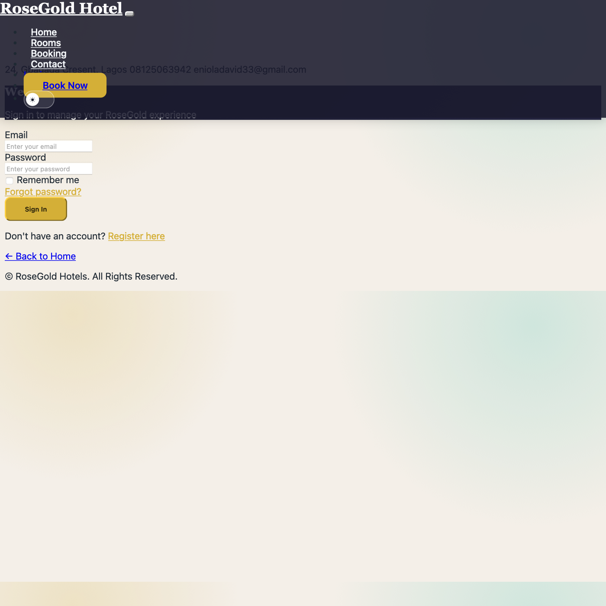

*Figure 4.1: Login interface showing the email-based access form used to enter the hotel system.*

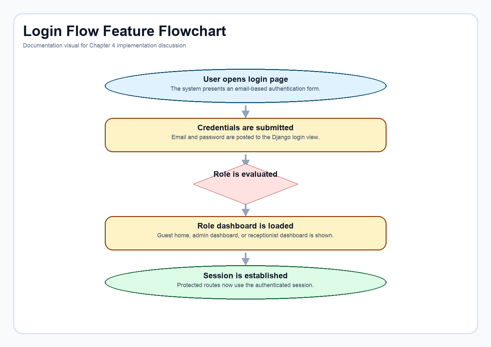

*Figure 4.2: Role-aware login flow from credential submission to dashboard redirection.*

**Code extract: Role-aware redirect helper**

*This helper centralizes post-login routing and keeps redirection decisions predictable for guests, staff, and reception users. Source: `Django_practice_Pro_hotel_management_system-main/HotelApp/views.py (lines 47-70)`.*

```python
def get_post_login_route_name(user):
    if user.is_receptionist:
        return "receptionist_dashboard"
    elif user.is_staff:
        return "dashboard"
    else:
        return "user_home"


def get_safe_next_url(request):
    """Return the ?next= redirect target if it is safe, otherwise return ''."""
    next_url = request.POST.get("next") or request.GET.get("next", "")
    if next_url and url_has_allowed_host_and_scheme(
        next_url,
        allowed_hosts={request.get_host()},
        require_https=request.is_secure(),
    ):
        return next_url
    return ""


def get_post_login_redirect(request, user):
    next_url = get_safe_next_url(request)
    return next_url or reverse(get_post_login_route_name(user))
```

### 4.2.2 Rooms Catalogue and Room Management Context

The rooms feature is more than a gallery. It is the system's public inventory layer, and every booking, payment, dashboard summary, and room-status decision depends on it. The room records store pricing, room type, operational status, facilities, and housekeeping information, which means the same entity serves both guest-facing and staff-facing needs.

In the user experience, the room catalogue translates that stored information into a clear visual list. In the internal workflow, the same room model supports reservation checks, dashboard statistics, maintenance visibility, and turnover readiness.

**Implementation note:** The room model was designed with both commercial and operational fields so that one record can support public display, booking validation, and internal control views without duplicated data structures.

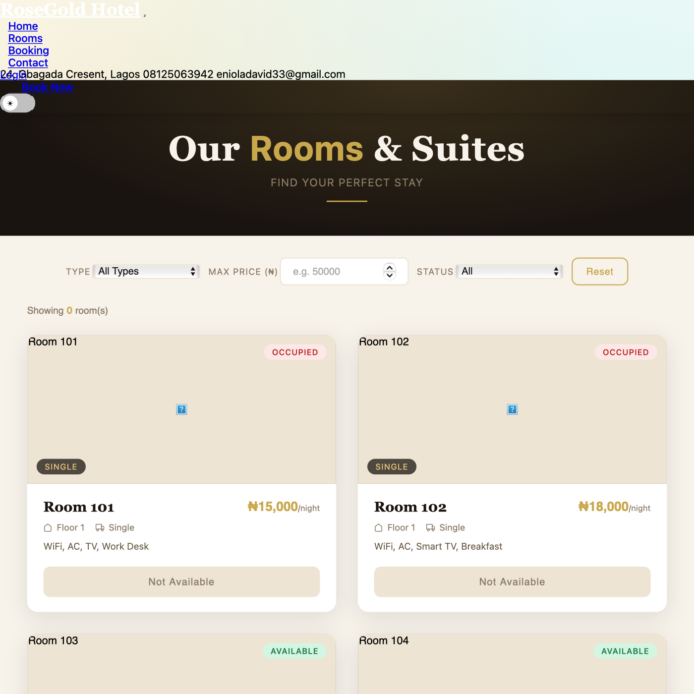

*Figure 4.3: Public room catalogue showing room type, price, facilities, and current availability state.*

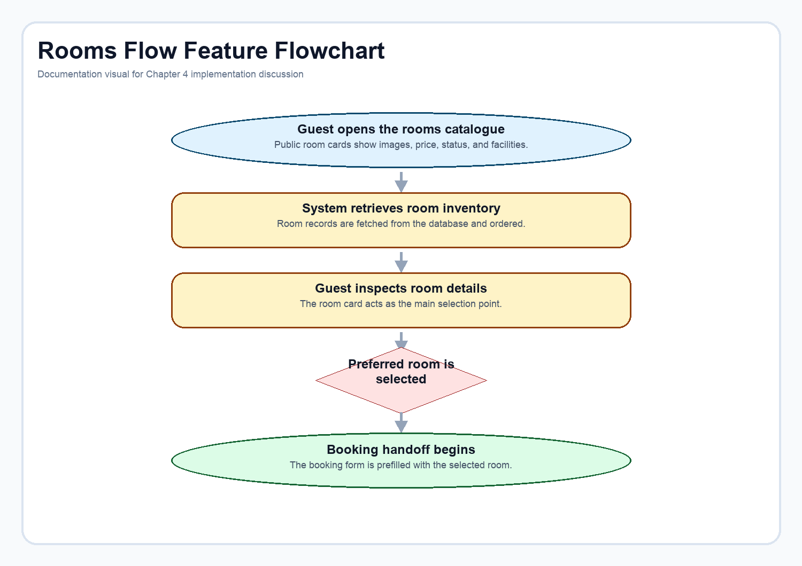

*Figure 4.4: Room-discovery flow from public catalogue browsing to booking handoff.*

**Code extract: Core room model**

*This model defines the inventory attributes that drive both the catalogue view and the staff dashboards. Source: `Django_practice_Pro_hotel_management_system-main/HotelApp/models.py (lines 57-89)`.*

```python
class Room(models.Model):
    ROOM_STATUS = [
        ('available', 'Available'),
        ('occupied', 'Occupied'),
        ('maintenance', 'Maintenance'),
        ('reserved', 'Reserved'),
    ]

    ROOM_TYPES = [
        ('single', 'Single'),
        ('double', 'Double'),
        ('suite', 'Suite'),
    ]

    HOUSEKEEPING_STATUS = [
        ('clean', 'Clean'),
        ('dirty', 'Dirty'),
        ('in_progress', 'In Progress'),
    ]

    room_number = models.CharField(max_length=50, unique=True)
    room_type = models.CharField(max_length=20, choices=ROOM_TYPES, db_index=True)
    floor = models.IntegerField()
    facility = models.TextField()
    price = models.DecimalField(max_digits=10, decimal_places=2)
    image = models.ImageField(upload_to='rooms/', blank=True, null=True)
    status = models.CharField(max_length=20, choices=ROOM_STATUS, default='available', db_index=True)
    housekeeping_status = models.CharField(max_length=20, choices=HOUSEKEEPING_STATUS, default='clean')
    last_cleaned = models.DateTimeField(blank=True, null=True)
    created_at = models.DateTimeField(auto_now_add=True)

    def __str__(self):
        return f"Room {self.room_number} ({self.room_type})"
```

### 4.2.3 Booking Workflow

The booking workflow was implemented as a controlled sequence rather than a form that immediately creates a reservation record. The guest selects a room, chooses dates, enters occupancy details, and triggers server-side validation that checks date order and room-conflict conditions. Only when the booking data is valid does the system move it forward to the payment stage.

That approach improves reliability. It ensures that stay details are preserved long enough to support payment processing, yet the final booking record is not written prematurely. For a final-year project, this is a more realistic workflow than simply saving any submitted reservation request without transactional control.

**Implementation note:** The system stores the validated booking payload in session as `pending_booking`, which creates a clean handoff between booking validation and Paystack payment.

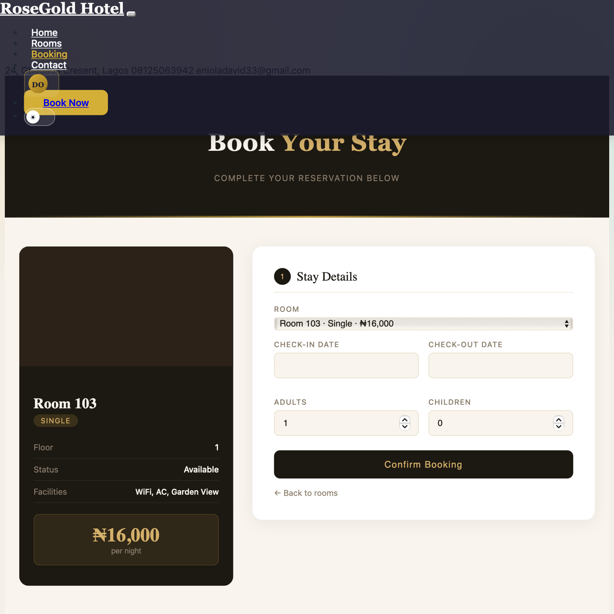

*Figure 4.5: Booking page showing room context, date selection, and guest-count inputs before payment.*

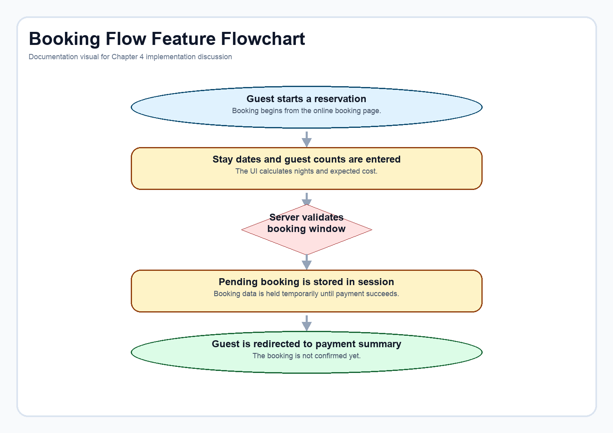

*Figure 4.6: Validated booking flow from stay details to the pending-payment handoff.*

**Code extract: Booking validation and session handoff**

*This excerpt shows how the view validates user input and stores a pending booking in session before payment begins. Source: `Django_practice_Pro_hotel_management_system-main/HotelApp/views.py (lines 521-558)`.*

```python
try:
    check_in = datetime.strptime(form_data["check_in"], "%Y-%m-%d").date()
    check_out = datetime.strptime(form_data["check_out"], "%Y-%m-%d").date()
except (TypeError, ValueError):
    check_in = check_out = None
    messages.error(request, "Please enter valid dates.")

try:
    adults = int(form_data["adults"])
    children = int(form_data["children"])
except (TypeError, ValueError):
    adults = children = None
    messages.error(request, "Please enter valid guest counts.")

if check_in and check_out and check_in >= check_out:
    messages.error(request, "Check-out must be after check-in.")

if adults is not None and (adults <= 0 or children < 0):
    messages.error(request, "Please enter valid guest counts.")

if selected_room and check_in and check_out and adults is not None:
    if booking_window_has_conflict(selected_room, check_in, check_out):
        messages.error(request, "Room is not available for the selected dates.")
    else:
        # Store booking data in session for payment processing
        request.session['pending_booking'] = {
            'room_id': selected_room.id,
            'check_in': form_data["check_in"],
            'check_out': form_data["check_out"],
            'adults': adults,
            'children': children,
            'city': form_data["city"],
            'country': form_data["country"],
            'address': form_data["address"],
        }

        # Redirect to payment page instead of creating booking
        return redirect("booking_payment_page")
```

### 4.2.4 Paystack Payment Workflow

Payment is an active part of the booking lifecycle in the current implementation. The guest reviews a structured payment summary and then proceeds through Paystack checkout. The application does not simply assume success; it initializes a transaction, stores a pending payment record, waits for the callback, verifies the returned reference, and only then creates the confirmed booking.

This feature significantly strengthens the realism of the project. It demonstrates how a hospitality system can connect booking data, payment state, activity logging, and room reservation status inside one workflow. It also shows that the platform has evolved beyond the earlier academic-prototype pattern of internal payment notes only.

**Implementation note:** The payment flow is split into two controlled stages: transaction initialization and callback verification. This allows booking creation to depend on server-side confirmation rather than on client-side assumption.

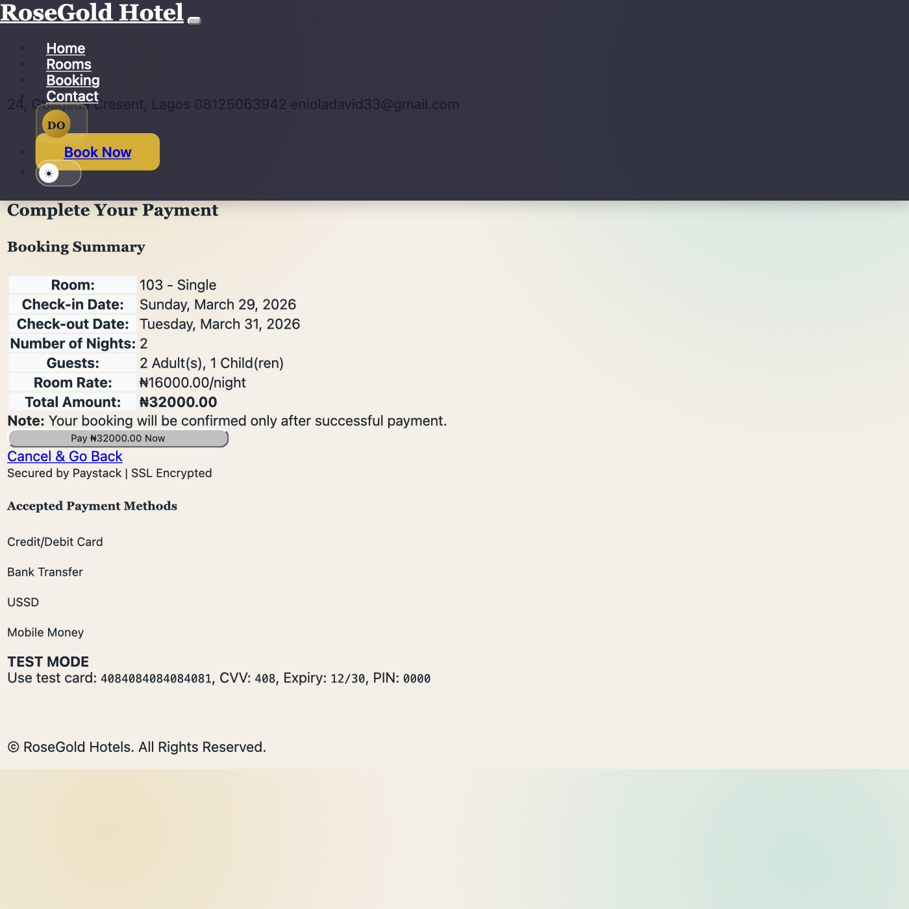

*Figure 4.7: Payment summary page used to review reservation details before redirecting to Paystack.*

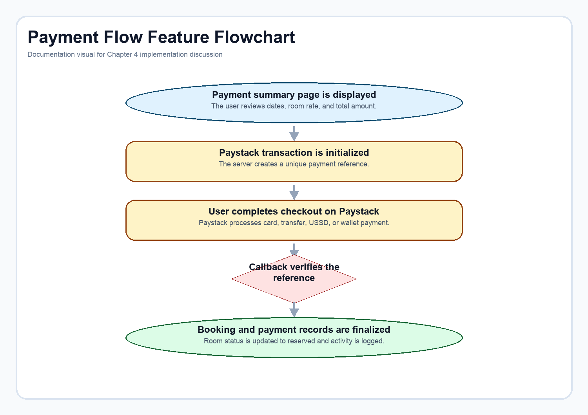

*Figure 4.8: Paystack-backed payment sequence from pending booking to verified reservation.*

**Code extract: Paystack transaction initialization**

*The initialization stage calculates the payable amount, creates a unique reference, and opens a pending payment record before redirecting to Paystack. Source: `Django_practice_Pro_hotel_management_system-main/HotelApp/views.py (lines 1414-1466)`.*

```python
@login_required
def initiate_payment(request):
    """Initialize Paystack payment for a booking"""
    if request.method != 'POST':
        return redirect('online_booking')

    # Get booking details from session
    booking_data = request.session.get('pending_booking')
    if not booking_data:
        messages.error(request, "No pending booking found. Please start booking process again.")
        return redirect('online_booking')

    try:
        room = Room.objects.get(id=booking_data['room_id'])
        check_in = datetime.strptime(booking_data['check_in'], '%Y-%m-%d').date()
        check_out = datetime.strptime(booking_data['check_out'], '%Y-%m-%d').date()

        # Calculate amount
        nights = (check_out - check_in).days
        amount = int(room.price * nights * 100)  # Convert to kobo (Paystack uses kobo)

        # Generate payment reference
        reference = generate_payment_reference()

        # Initialize Paystack transaction
        paystack = Paystack(secret_key=settings.PAYSTACK_SECRET_KEY)
        response = paystack.transaction.initialize(
            email=request.user.email,
            amount=amount,
            reference=reference,
            callback_url=request.build_absolute_uri(reverse('payment_callback'))
        )

        if response['status']:
            # Store payment reference in session
            request.session['payment_reference'] = reference
            request.session['payment_amount'] = float(room.price * nights)

            # Create pending payment record
            Payment.objects.create(
                booking_type='online',
                booking_id=0,  # Will be updated after booking creation
                amount=room.price * nights,
                payment_method='paystack',
                payment_status='pending',
                receipt_number=reference,
                paystack_reference=reference,
                paystack_access_code=response['data']['access_code'],
                created_by=request.user
            )

            # Redirect to Paystack checkout
            return redirect(response['data']['authorization_url'])
```

**Code extract: Payment callback and booking confirmation**

*The callback stage verifies the reference, creates the final booking, updates the payment status, and reserves the room. Source: `Django_practice_Pro_hotel_management_system-main/HotelApp/views.py (lines 1486-1523)`.*

```python
try:
    # Verify payment with Paystack
    paystack = Paystack(secret_key=settings.PAYSTACK_SECRET_KEY)
    response = paystack.transaction.verify(reference=reference)

    if response['status'] and response['data']['status'] == 'success':
        # Get pending booking data
        booking_data = request.session.get('pending_booking')
        if not booking_data:
            messages.error(request, "Booking data not found.")
            return redirect('user_home')

        # Create the booking
        room = Room.objects.get(id=booking_data['room_id'])
        booking = OnlineBooking.objects.create(
            user=request.user,
            room=room,
            check_in=booking_data['check_in'],
            check_out=booking_data['check_out'],
            adults=booking_data.get('adults', 1),
            children=booking_data.get('children', 0),
            city=booking_data.get('city', ''),
            country=booking_data.get('country', ''),
            address=booking_data.get('address', ''),
            status='confirmed'
        )

        # Update payment record
        payment = Payment.objects.get(paystack_reference=reference)
        payment.booking_id = booking.id
        payment.payment_status = 'paid'
        payment.paid_at = timezone.now()
        payment.paystack_response = response['data']
        payment.save()

        # Update room status
        room.status = 'reserved'
        room.save()
```

### 4.2.5 Administrative Dashboard

The custom administrative dashboard acts as the management cockpit of the system. It brings together booking totals, room availability, occupancy rate, user counts, salary figures, booking trends, and recent monitoring alerts inside a single page. This gives administrators a working picture of the hotel's current state instead of forcing them to inspect isolated tables one by one.

The dashboard is especially important in this project because it also bridges ordinary hotel operations with smart monitoring. The HSE summary appears in the same space as the business metrics, which reinforces the idea that safety is an operational concern rather than a side system.

**Implementation note:** The dashboard view aggregates counts, trend values, revenue estimates, and IoT summaries directly from the database so that the page behaves like a live operational dashboard rather than a static mock-up.

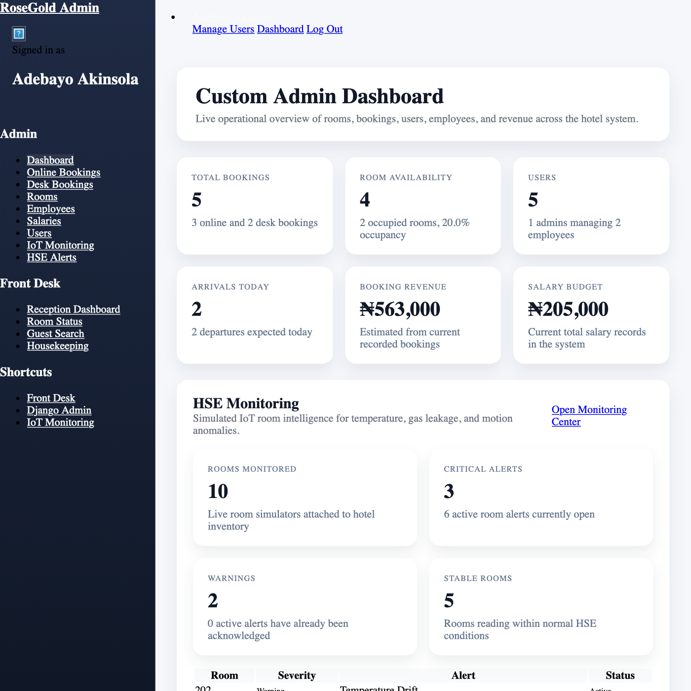

*Figure 4.9: Custom administrator dashboard showing operational summaries and integrated HSE monitoring cards.*

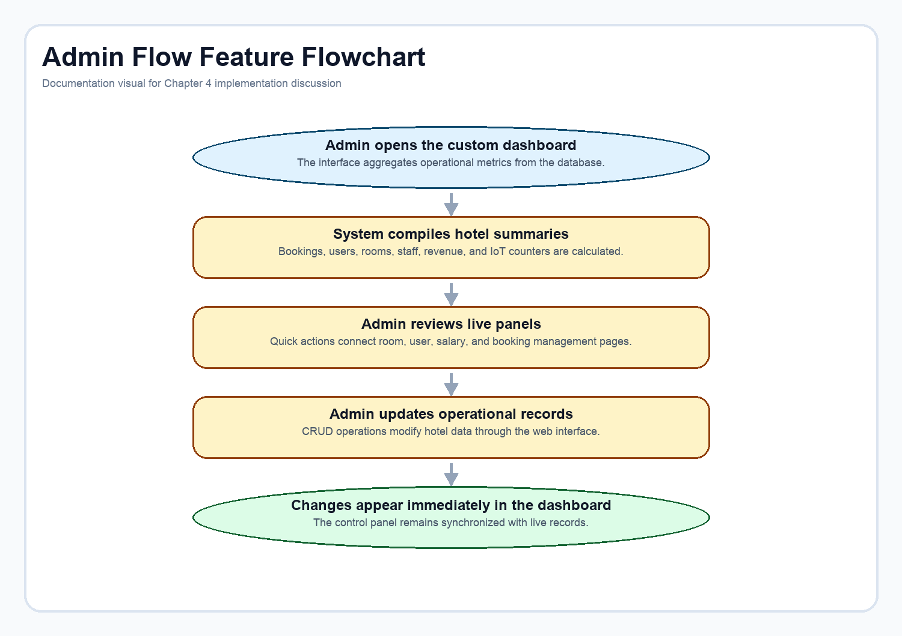

*Figure 4.10: Administrative control flow from dashboard load to live management actions.*

**Code extract: Administrative metric aggregation**

*This excerpt shows how the dashboard compiles room, booking, user, revenue, and IoT summary values before rendering the page. Source: `Django_practice_Pro_hotel_management_system-main/HotelApp/views.py (lines 177-233)`.*

```python
def dashboard(request):
    today = timezone.localdate()
    rooms = Room.objects.all()
    users = Authorregis.objects.all()
    employees = Employee.objects.all()
    online_bookings = OnlineBooking.objects.select_related("user", "room")
    offline_bookings = OfflineBooking.objects.select_related("room")
    salaries = Salary.objects.select_related("employee")

    room_status_counts = {
        "Available": rooms.filter(status="available").count(),
        "Occupied": rooms.filter(status="occupied").count(),
        "Maintenance": rooms.filter(status="maintenance").count(),
    }

    occupied_room_ids = set(
        online_bookings.filter(check_in__lte=today, check_out__gt=today).values_list("room_id", flat=True)
    )
    occupied_room_ids.update(
        offline_bookings.filter(check_in__lte=today, check_out__gt=today).values_list("room_id", flat=True)
    )

    total_rooms = rooms.count()
    total_online_bookings = online_bookings.count()
    total_offline_bookings = offline_bookings.count()
    total_bookings = total_online_bookings + total_offline_bookings
    total_users = users.count()
    total_staff_users = users.filter(is_staff=True).count()
    total_guest_users = users.filter(is_staff=False).count()
    total_employees = employees.count()
    available_rooms = rooms.filter(status="available").count()
    occupancy_rate = round((len(occupied_room_ids) / total_rooms) * 100, 1) if total_rooms else 0
    check_ins_today = online_bookings.filter(check_in=today).count() + offline_bookings.filter(check_in=today).count()
    check_outs_today = online_bookings.filter(check_out=today).count() + offline_bookings.filter(check_out=today).count()

    booking_labels, online_booking_series = monthly_totals(online_bookings, "created_at")
    _, offline_booking_series = monthly_totals(offline_bookings, "created_at")
    booking_series = [online + offline for online, offline in zip(online_booking_series, offline_booking_series)]

    account_distribution_labels = ["Admins", "Guests", "Employees"]
    account_distribution_values = [total_staff_users, total_guest_users, total_employees]

    estimated_revenue = calculate_booking_revenue(online_bookings.select_related("room")) + calculate_booking_revenue(
        offline_bookings.select_related("room")
    )
    monthly_salary_budget = sum((salary.salary for salary in salaries), Decimal("0"))
    iot_summary = None
    recent_iot_alerts = []

    try:
        from alerts.services import build_monitoring_snapshot
        from alerts.runtime import run_monitoring_cycle

        run_monitoring_cycle(force_refresh=False)
        iot_snapshot = build_monitoring_snapshot(force_refresh=False)
        iot_summary = iot_snapshot["summary"]
        recent_iot_alerts = iot_snapshot["alerts"][:5]
```

### 4.2.6 Receptionist Dashboard and Front-Desk Operations

The receptionist module was designed around day-to-day front-desk work rather than broad system administration. The dashboard emphasizes what matters during live operations: today's check-ins, today's check-outs, room statistics, pending housekeeping, recent activity, revenue collected today, and pending payments. This keeps the screen practical for front-desk decision making.

The workflow continues into related pages such as room status, guest search, housekeeping, check-in, check-out, and desk payment processing. In other words, the receptionist dashboard is not merely a smaller admin dashboard. It is a role-specific workspace tuned for speed, visibility, and frequent actions.

**Implementation note:** The receptionist view computes operational metrics around the current date and combines reservation queues with room status and payment summaries so that staff can act from one compact page.

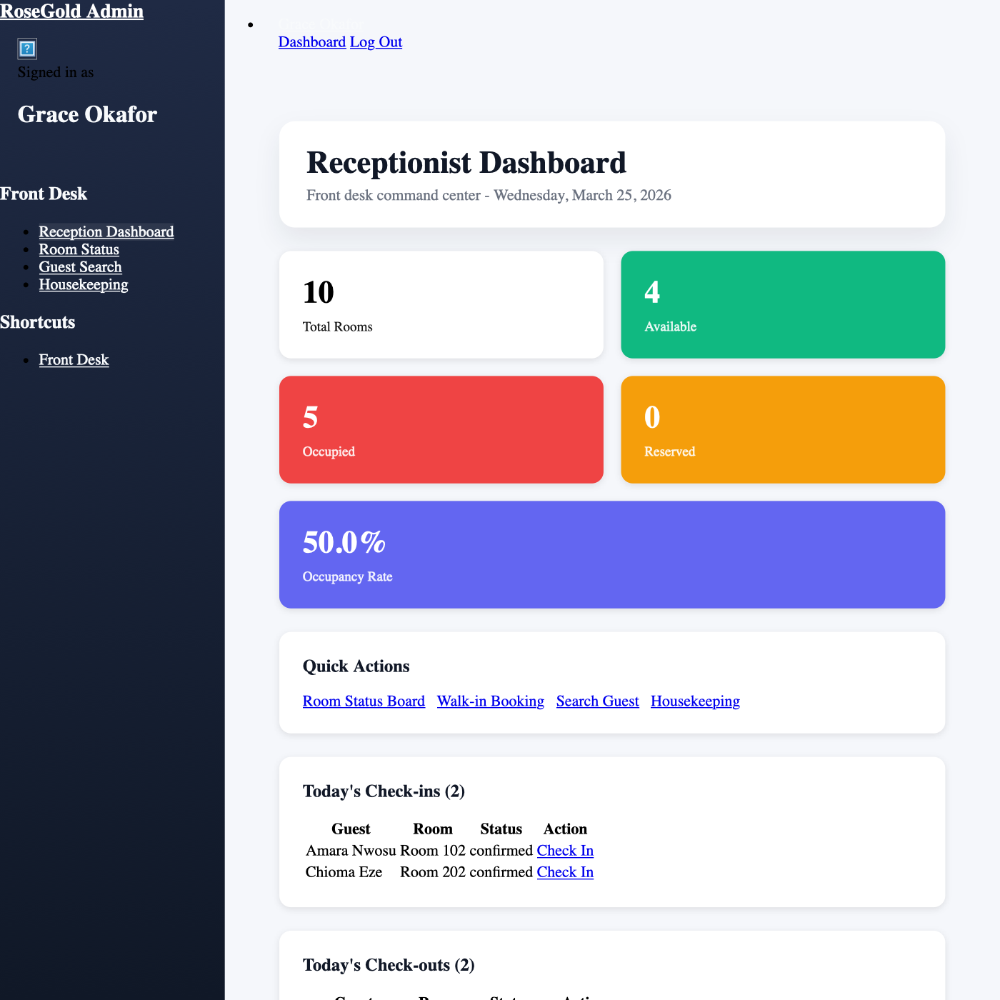

*Figure 4.11: Receptionist dashboard focused on arrivals, departures, room status, and front-desk quick actions.*

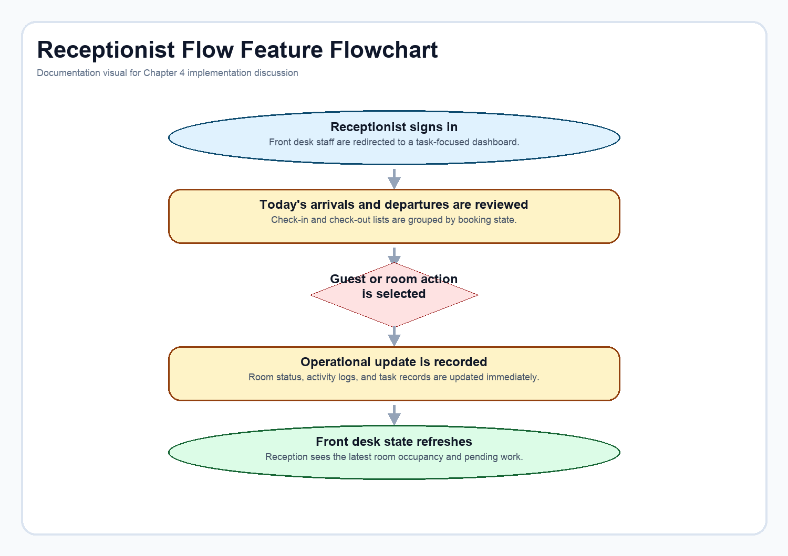

*Figure 4.12: Front-desk workflow from sign-in through room, guest, and housekeeping actions.*

**Code extract: Receptionist dashboard aggregation**

*This view builds the arrival/departure queues, room statistics, and payment summaries that make the receptionist interface task-oriented. Source: `Django_practice_Pro_hotel_management_system-main/HotelApp/views.py (lines 963-1038)`.*

```python
@receptionist_required
def receptionist_dashboard(request):
    today = timezone.localdate()
    now = timezone.now()

    # Today's check-ins and check-outs
    todays_checkins_online = OnlineBooking.objects.filter(
        check_in=today,
        status__in=['confirmed', 'pending']
    ).select_related('user', 'room').order_by('created_at')

    todays_checkins_offline = OfflineBooking.objects.filter(
        check_in=today,
        status__in=['confirmed', 'pending']
    ).select_related('room').order_by('created_at')

    todays_checkouts_online = OnlineBooking.objects.filter(
        check_out=today,
        status='checked_in'
    ).select_related('user', 'room').order_by('created_at')

    todays_checkouts_offline = OfflineBooking.objects.filter(
        check_out=today,
        status='checked_in'
    ).select_related('room').order_by('created_at')

    # Room statistics
    total_rooms = Room.objects.count()
    available_rooms = Room.objects.filter(status='available').count()
    occupied_rooms = Room.objects.filter(status='occupied').count()
    reserved_rooms = Room.objects.filter(status='reserved').count()
    maintenance_rooms = Room.objects.filter(status='maintenance').count()

    # Housekeeping tasks
    pending_housekeeping = HousekeepingTask.objects.filter(
        status='pending'
    ).select_related('room').order_by('-priority', 'created_at')[:5]

    # Recent activity
    recent_activities = ActivityLog.objects.select_related('user', 'room').order_by('-created_at')[:10]

    # Revenue today
    today_payments = Payment.objects.filter(
        paid_at__date=today,
        payment_status='paid'
    ).aggregate(total=Sum('amount'))
    revenue_today = today_payments['total'] or Decimal('0.00')

    # Guests in house
    guests_in_house = OnlineBooking.objects.filter(status='checked_in').count() + \
                     OfflineBooking.objects.filter(status='checked_in').count()

    # Pending payments
    pending_payments_count = Payment.objects.filter(payment_status='pending').count()

    context = build_admin_context(
        "receptionist_dashboard",
        todays_checkins_online=todays_checkins_online,
        todays_checkins_offline=todays_checkins_offline,
        todays_checkouts_online=todays_checkouts_online,
        todays_checkouts_offline=todays_checkouts_offline,
        total_rooms=total_rooms,
        available_rooms=available_rooms,
        occupied_rooms=occupied_rooms,
        reserved_rooms=reserved_rooms,
        maintenance_rooms=maintenance_rooms,
        occupancy_rate=round((occupied_rooms / total_rooms * 100), 1) if total_rooms > 0 else 0,
        pending_housekeeping=pending_housekeeping,
        recent_activities=recent_activities,
        revenue_today=revenue_today,
        guests_in_house=guests_in_house,
        pending_payments_count=pending_payments_count,
        today=today,
    )

    return render(request, "admin/ReceptionistDashboard.html", context)
```

### 4.2.7 IoT Monitoring and HSE Alerting

The IoT monitoring module is the most distinctive part of the project. Each room is mapped to a logical device, sensor readings are stored over time, and rules convert those readings into warning or critical conditions based on temperature, gas level, motion state, and expected occupancy. The result is a monitoring dashboard that behaves like a live operational subsystem rather than a decorative front-end panel.

The HSE value of the feature lies in persistence and lifecycle. The system does not merely flash a warning; it stores readings, opens alerts, allows acknowledgement, records resolution, and makes recent incidents visible to administrators. That history is important because hotel safety work depends on accountability, not on momentary visual effects.

**Implementation note:** The monitoring logic separates payload evaluation from persistence. That design keeps the thresholds explicit and allows the same alert lifecycle to work whether readings are simulated or later connected to real devices.

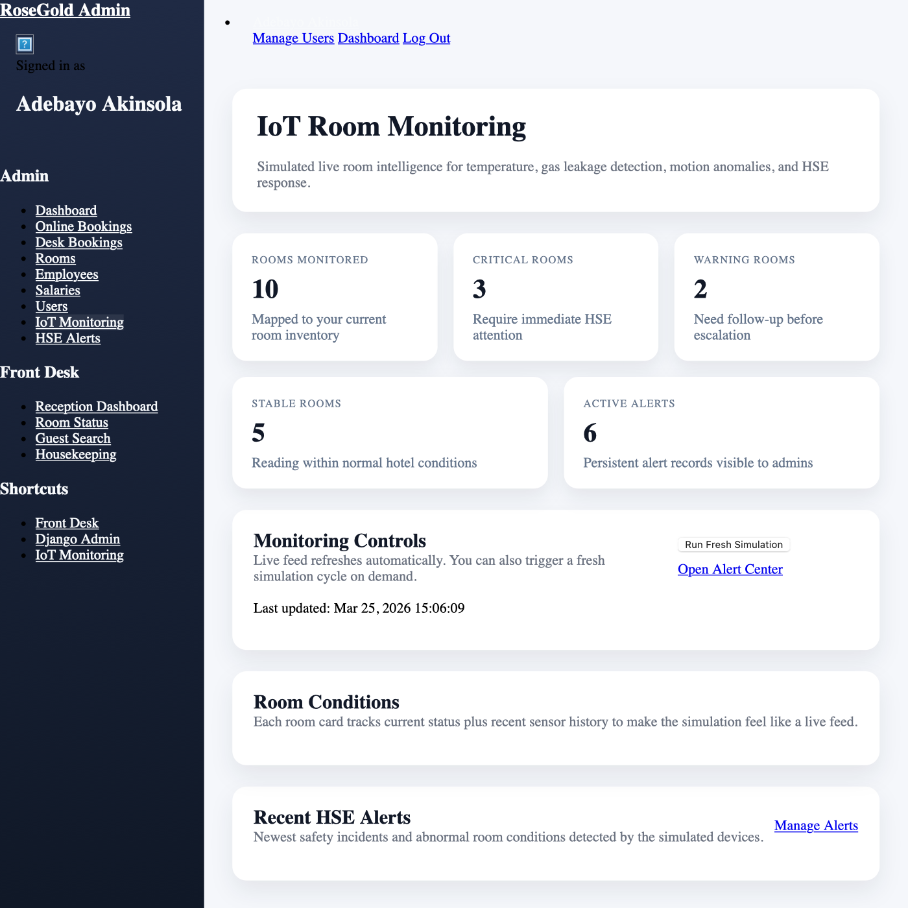

*Figure 4.13: IoT monitoring dashboard showing room-condition summaries and active HSE alert counts.*

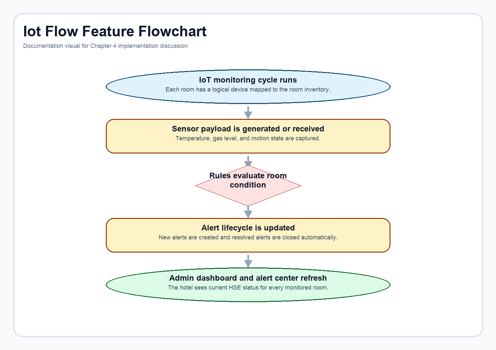

*Figure 4.14: Monitoring lifecycle from sensor payload evaluation to alert refresh on the admin pages.*

**Code extract: Room-condition rule evaluation**

*The rule engine evaluates temperature, gas, and motion signals against room context to classify each reading as normal, warning, or critical. Source: `Django_practice_Pro_hotel_management_system-main/alerts/services.py (lines 213-311)`.*

```python
def evaluate_payload(device, payload):
    room = device.room
    issues = []
    temperature_c = payload["temperature_c"]
    gas_level = payload["gas_level"]
    motion_state = payload["motion_state"]
    occupancy_expected = payload["occupancy_expected"]

    low_warning = device.temperature_min_normal - 2.0
    low_critical = device.temperature_min_normal - 4.0
    high_warning = device.temperature_max_normal + 1.5
    high_critical = device.temperature_max_normal + 3.5

    if temperature_c <= low_critical or temperature_c >= high_critical:
        issues.append(
            {
                "type": "temperature",
                "severity": "critical",
                "message": (
                    f"Room {room.room_number} temperature is {temperature_c}°C, "
                    f"outside the safe operating range."
                ),
            }
        )
    elif temperature_c <= low_warning or temperature_c >= high_warning:
        issues.append(
            {
                "type": "temperature",
                "severity": "warning",
                "message": (
                    f"Room {room.room_number} temperature is drifting at {temperature_c}°C "
                    f"and should be checked."
                ),
            }
        )

    if gas_level >= device.gas_critical_threshold:
        issues.append(
            {
                "type": "gas",
                "severity": "critical",
                "message": (
                    f"Room {room.room_number} gas concentration reached {gas_level} ppm. "
                    f"Immediate HSE response is recommended."
                ),
            }
        )
    elif gas_level >= device.gas_warning_threshold:
        issues.append(
            {
                "type": "gas",
                "severity": "warning",
                "message": (
                    f"Room {room.room_number} gas concentration is {gas_level} ppm, above the warning threshold."
                ),
            }
        )

    if not occupancy_expected and motion_state == "tamper":
        issues.append(
            {
                "type": "motion",
                "severity": "critical",
                "message": (
                    f"Tamper-level motion was detected in Room {room.room_number} while it should be secured."
                ),
            }
        )
    elif not occupancy_expected and motion_state == "active":
        issues.append(
            {
                "type": "motion",
                "severity": "warning",
                "message": (
                    f"Unexpected activity was detected in Room {room.room_number}. "
                    f"Front desk or security should confirm the room condition."
                ),
            }
        )
    elif occupancy_expected and motion_state == "tamper":
        issues.append(
            {
                "type": "motion",
                "severity": "warning",
                "message": (
                    f"Forceful motion signature was detected in occupied Room {room.room_number}. "
                    f"Please verify guest safety."
                ),
            }
        )

    if any(issue["severity"] == "critical" for issue in issues):
        overall_status = "critical"
    elif issues:
        overall_status = "warning"
    else:
        overall_status = "normal"

    return overall_status, issues
```

**Code extract: Sensor persistence and alert synchronization**

*Once evaluated, each payload is stored as a sensor reading and immediately synchronized with the active alert set for the room. Source: `Django_practice_Pro_hotel_management_system-main/alerts/services.py (lines 314-335)`.*

```python
@transaction.atomic
def record_sensor_payload(device, payload, *, simulated=True):
    overall_status, issues = evaluate_payload(device, payload)
    reading = SensorReading.objects.create(
        device=device,
        room=device.room,
        temperature_c=payload["temperature_c"],
        gas_level=payload["gas_level"],
        motion_state=payload["motion_state"],
        occupancy_expected=payload["occupancy_expected"],
        overall_status=overall_status,
        issues=issues,
        simulated=simulated,
        recorded_at=payload.get("recorded_at") or timezone.now(),
    )

    device.last_seen_at = reading.recorded_at
    device.is_online = True
    device.save(update_fields=["last_seen_at", "is_online", "updated_at"])

    sync_alerts_for_reading(device, reading)
    return reading
```

## 4.3 Testing and Validation

System validation was approached from two directions. First, the project was exercised manually through the same demonstration paths shown in this document: login, room browsing, booking entry, payment summary display, admin dashboard loading, receptionist dashboard loading, and IoT dashboard review. Second, the repository's Django test suite was executed to confirm the health of the built-in regression coverage around login routing, dashboard behaviour, receptionist bootstrap, and monitoring logic.

The automated test run executed 35 tests. Most of the suites completed successfully, particularly the routing, home-view resilience, receptionist environment bootstrap, and IoT monitoring tests. Three older custom-admin assertions failed because they no longer align with the current seeded-room behaviour and current admin form outcomes. That result does not invalidate the documented feature set, but it does show that the admin regression suite should be refreshed as the project evolves.

*Table 4.1: Summary of the main validation scenarios considered during the documentation refresh.*

| Scenario | Validation style | Observed result |
| --- | --- | --- |
| Login redirects by user role | Automated and manual | Working in the current codebase and visible in the demo pages |
| Room catalogue displays inventory and status | Manual | Working in the demo environment used for documentation screenshots |
| Booking form preserves validated pending data | Manual and code inspection | Working through session handoff to the payment summary page |
| Payment flow initializes Paystack transaction data | Code inspection and manual summary-page review | Implemented in the active project flow |
| Admin dashboard compiles live metrics | Manual and automated coverage | Visible in the demo environment; some older admin tests need maintenance |
| Reception dashboard builds daily queues and summaries | Automated and manual | Working in both the rendered demo page and repository logic |
| IoT monitoring records readings and alerts | Automated and manual | Working in the repository test suite and the generated demo dashboard |

## 4.4 Discussion

Taken together, the implemented features show that the project has moved beyond a narrow booking website. It now behaves like a compact hospitality operations platform with payment control, staff workflow support, and HSE visibility. The most important design achievement is integration: reservation state, room state, payment state, staff actions, and alert state all live inside one application.

The documentation refresh also makes that integration easier to communicate during presentation. Each feature is shown with its interface, logic flow, and code evidence, which means the final-year report can speak to both technical depth and practical usability. That balance is often where academic system projects struggle, and it is the main reason this regenerated document is more suitable for presentation than the earlier draft.

## 4.5 Summary

This chapter has shown the final system as it exists today: role-aware, payment-backed, operationally structured, and enriched with simulated IoT monitoring. The presentation-focused layout of this refreshed documentation now makes the project easier to defend academically because each major feature is supported by interface evidence, flow logic, and implementation excerpts from the real codebase.
